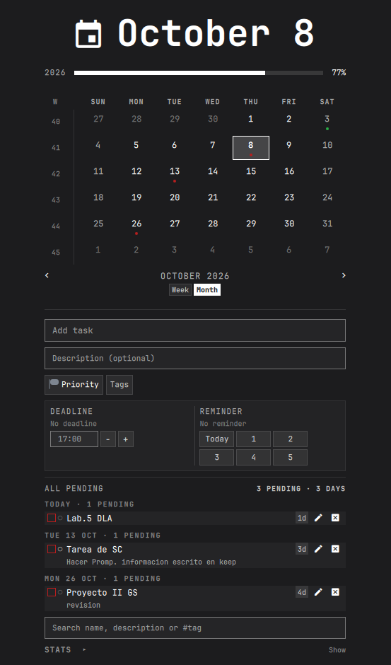
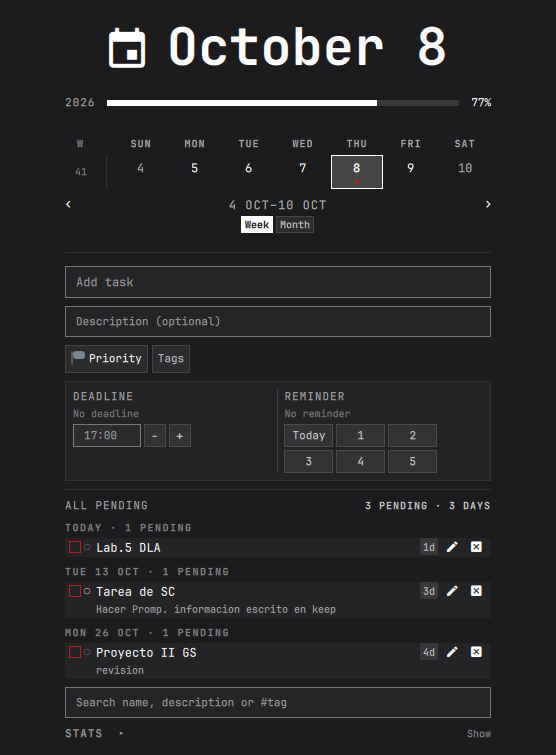
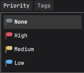
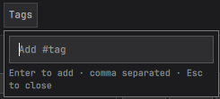

# Cronos-Calendar

**Your tasks, on the clock you already stare at.** Click the time in the bar
and the month opens with every task sitting on the day it is due — countdowns,
priorities, tags, and reminders that still fire after a reboot. A fork of
Omarchy's built-in `omarchy.clock` that keeps everything the clock had.

## Screenshots

The month grid: every task sits in the day it is due, the dots on a day are
its tasks, and overdue is the red one.



The week strip over the composer and the list of everything outstanding,
soonest first:



Priority and tags, both set from the composer:

 

## Install

```bash
omarchy plugin add https://github.com/angelherman0130-cell/omarchy-cronos-calendar --enable
```

Or copy the directory into `~/.config/omarchy/plugins/angelherman.cronos-calendar`
and add it to a bar section:

```bash
omarchy bar put angelherman.cronos-calendar center
```

## Uninstall

```bash
omarchy plugin remove angelherman.cronos-calendar --yes
```

That unloads the widget and, since it was cloned from `omarchy.clock`, puts
the stock clock back where it was. It does not touch the reminder timer, which
lives outside the plugin directory:

```bash
systemctl --user disable --now omarchy-clock-reminders.timer
rm -f ~/.config/systemd/user/omarchy-clock-reminders.service \
      ~/.config/systemd/user/omarchy-clock-reminders.timer
systemctl --user daemon-reload
```

Your tasks stay in `~/.local/state/omarchy/clock-tasks.json`. Delete that file
as well when you want the data itself gone:

```bash
rm -f ~/.local/state/omarchy/clock-tasks.json
```

## What it does

- **Clock and calendar.** Click the bar label: week or month grid with ISO
  weeks, month stepping and the year rail — everything the stock clock had.
- **Tasks per day.** Add one from the field at the top, tick it off, edit or
  delete it from the row. Optional description under the name.
- **Everything outstanding, soonest first.** Every pending task, grouped by
  its day, with a countdown (`2d 3h`, `45m`) on each deadline. Click a group
  heading to narrow to that day, click a day to widen back out.
- **Deadline and reminder per task.** A due time (`17:00`, nudged with `−`/`+`)
  and a reminder for the due day or 1–5 days before. Reminders survive a
  reboot, arrive on the hour, and a missed one fires when the machine returns.
- **Priority and tags.** Four priorities (`▲ ● ○`), tags typed as `#tag` —
  clicking a chip filters the list. Search by name, description or tag.
- **Statistics.** A collapsed `STATS` block: streak, today, the last seven
  days, and how the pending work falls across the three priorities.
- **Undo.** Deleting reports itself with a toast — *Task deleted · Undo* —
  held for six seconds.
- **Colour.** Red means still owed, green means finished. Nothing else uses
  those two, so a glance at a day says what is outstanding.

### Keyboard

| Key       | Action                              |
|-----------|-------------------------------------|
| `[` `]`   | Previous / next week or month, whichever view is on |
| `{` `}`   | Previous / next year (52 weeks in the week view) |
| `t`       | Jump to today (does not change the list's view) |
| `n`       | Focus the task field                |
| `s`       | Focus the search field              |
| `v`       | Toggle week / month                 |
| `w`       | Toggle week start (Monday / Sunday) |
| arrows    | Move month / year                   |
| `Enter`   | Commit the field being edited       |
| `Esc`     | Clear the field, or discard the row edit |

## How reminders survive a reboot

A single persistent `systemd --user` timer and service, not one timer per
task:

- `omarchy-clock-reminders.timer` — `Persistent=yes`, so a reminder due while
  the machine was off fires at the next boot.
- `omarchy-clock-reminders.service` — reads the store and sends one toast per
  reminder that is due.

Both are generated by `ClockReminders.sh install` and rewritten on every
install, so do not hand-edit them; the header says so.

`Persistent=yes` replays the *timer run* that was missed, and the script then
reads today's date — so on its own it cannot rescue a reminder whose whole day
passed while the machine was off. That is what the window in the script below
is for; between them the two cover a machine that was off overnight and one
that was off for a week.

## Tests

No framework and no dependencies. `Tasks.js` and `Model.js` are deliberately
free of Qt so that the arithmetic, the store mutations and the calendar's own
date maths are testable under plain node:

    node --test tests/*.test.js

The glob matters: `node --test tests/` is read as a module to load rather than
a directory to walk.

`Model.js` has its own file because the grids are the part a change is most
likely to bend without anything looking broken: six rows of cells the whole
panel is drawn from, and now a seventh view that has to be made of the very
same cells or the two grids would drift apart in what a day is.

`ClockReminders.sh` is covered too, because the two bugs most worth keeping
locked down are both invisible to a unit test of `Tasks.js` — the script is a
second, independent reader of the store that runs whether or not the panel has
ever been opened:

    bash tests/reminders.test.sh

It fakes `date`, the notifier and all four sound players on `PATH`, so every
case can be run at the day and the hour it is actually about instead of only
at the one today happens to be — and so the alert can be asserted on which
player it reached and with which sample, rather than only that something
played.

Each fixture gets its own file. They used to share one, which was fine while
each was written immediately before it was read; a later fixture would quietly
become what every earlier reference pointed at, and a test would then report
"no notification" as the honest answer to a store it was never given.

## Requirements

- Omarchy with the Quickshell shell (v4 / "Quattro" or later).
- `jq`.
- A systemd user session, for the reminder timer.
- `omarchy-notification-send`. Without it the script sends nothing and exits
  quietly rather than failing loudly.

For the optional alert, in this order and each entirely optional: `paplay`,
`pw-play`, `aplay`, then `canberra-gtk-play`. The sample is looked for under
`$XDG_DATA_DIRS` (`sounds/freedesktop/stereo/message.oga` and its kin) or,
when that is unset, under `/usr/local/share` and `/usr/share`. Nothing found
means silence — the notification still arrives, and the timer still exits 0.

Tasks live in `~/.local/state/omarchy/clock-tasks.json`. That path predates
the rename and was left alone so existing tasks keep working.

## Upgrading

Version 2.0.0 changed the plugin id. Your `shell.json` still names the old
one, so after updating the widget will be missing from the bar:

```bash
omarchy bar put angelherman.cronos-calendar center
```

Reminders stored by 1.x keep their meaning. In 1.x a `remindDaysBefore` of
`0` meant "off" and the loader folded it to `null`; in 2.x `0` means "the day
of the due date itself". The loader migrates old files, so a `0` in a
version 1 file still loads as "off" instead of silently becoming an alarm.
See `CHANGELOG.md` for the full list of breaking changes.

## Notes

`moduleName` and the IPC target are still `omarchy.clock`. This is
intentional: the `pretty.omagen` bar plugin recognises a clock by that name,
and `shell.json`'s `centerAnchor` points at it. Renaming them would cost the
widget its styling and its centred position in the bar.

The plugin id is lowercase `angelherman.cronos-calendar` to follow Omarchy's
naming convention. The name you see in the menus is *Cronos-Calendar*.

## License

MIT. See `LICENSE`.

Forked from Omarchy's `omarchy.clock`, copyright (c) David Heinemeier
Hansson, which is MIT licensed. This fork is not endorsed by Omarchy.
